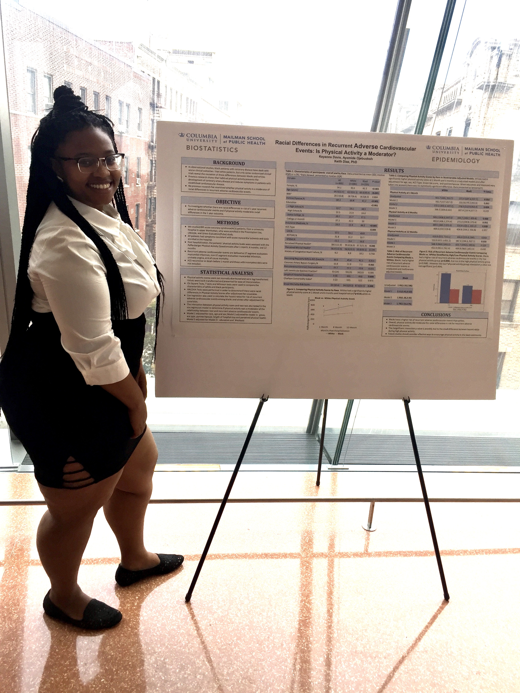

# Racial Differences in Recurrent Adverse Cardiovascular Events: Is Phyiscal Activity a Moderator?

In observational studies, black patients with coronary disease have dealt with worse clinical outcomes  than white patients, but only some randomized clinical trials reveal the causation of these differences between blacks and whites. Previous research shows that habitual physical activity prevents the development of coronary artery disease and reduces symptoms in patients with established cardiovascular disease.No previous research has examined whether physical activity is a moderator of racial differences in recurrent adverse cardiovascular events. I furthur investigated this issue. 

# Applications of Parabolic Partial Differential Equations to Food Proccessing, Food Preservation, and Cylinder Manufacturing 

Parabolic partial differential equations belong to one of the major
classes on partial differential equations, with the other two classes
being elliptic partial differential equations and hyperbolic partial
differential equations. In this paper, we will study both analytical
and numerical solutions of a class of parabolic partial differential
equations with Dirichlet boundary conditions. Furthermore, we
shall apply the methods studied to application problems: food
processing, food preservation, and cylinder manufacturing.

